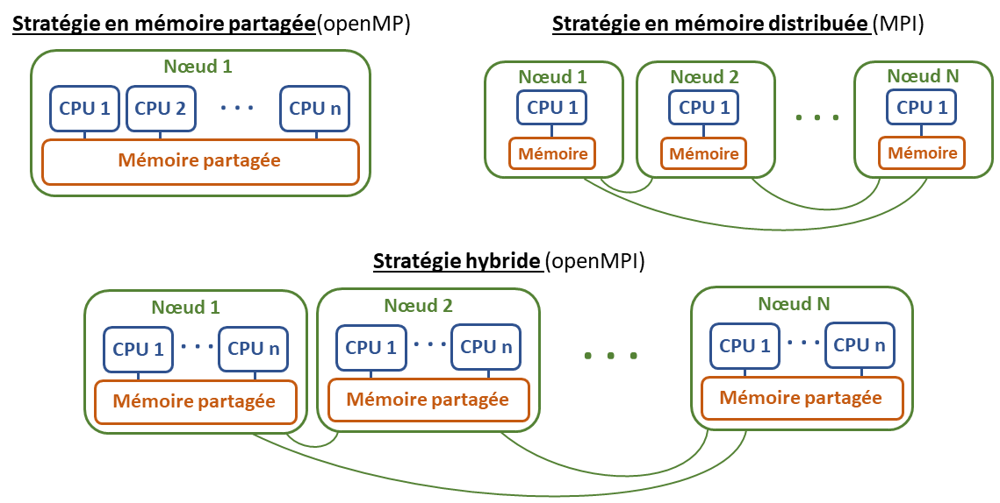

# Introduction to HPC cluster MESO-LR


***Axe transversal TIM, UR AIDA***

*Benjamin Heuclin, Statistician engineer, UR AIDA, Cirad*

*Septembre 2022*


<a rel="license" href="http://creativecommons.org/licenses/by-nc/4.0/"></a><br />This work is licensed under a <a rel="license" href="http://creativecommons.org/licenses/by-nc/4.0/">Creative Commons Attribution-NonCommercial 4.0 International License</a>.


___

1. [What is a supercomputer? And parallelization?](#cluster_parallelisation)
    1. [Parallelization](#parallelization)
    2. [The MESO@LR cluster at the University of Montpellier](#cluster)
2. [Cluster connection](#connection)
3. [File transfer](#transfer) 
4. [The storage spaces](#storage)
5. [Job submission process under SLURM](#proc_soumission)
6. [Useful SLURM commands](#commands)
7. [Rstudio on the cluster](#rstudio) 
8. [Resources](#resources)
*  [Annexes](#annexes)

    A.[Examples](#annexes_examples)
      1. [R OpenMP example parallel for loop](#ex_R_forloop)
      2. [R OpenMP example for random forest calibration](#ex_R_openMP)
      3. [R array example](#ex_R_array)
      
    B. [Script batch corrompu à cause des retours à la ligne WINDOWS](#annexes_unix_LF)
    
    C. [rsync](#annexes_rsync)
    
    
    
___


> This document is limited to the use of R on CPU, with shared memory parallelization (openMP). It is an initiation to quickly take control of the job submission process.

To use the cluster, you need a unix terminal to connect, submit and manage your jobs and a file transfer software to send your codes, ... from your PC to the cluster and vice versa.

Cluster documentations : https://meso-lr.umontpellier.fr/documentation-utilisateurs/


[######################################################################################]: # 

<br><br>

<a name="cluster_parallelisation"></a>

# 1. What is a supercomputer? And parallelization? 

---

[Wikipédia definition](https://fr.wikipedia.org/wiki/Superordinateur) : <br>
A supercomputer is a computer designed to achieve the highest possible performance with the techniques known at the time of its design, particularly in terms of computing speed. For performance reasons, it is almost always a mainframe computer, whose tasks are performed in batch mode. <br>
The science of supercomputing is called "high performance computing" (HPC). 

A supercomputer is generally a grouping of several independent computers called nodes, hence the term "cluster".


<a name="parallelization"></a>

## 1.1 Parallelization 

This link explains very well the different types of parallelization:

https://cwant.github.io/hpc-beyond/21-introduction-to-parallelism/index.html

> A task (or processus, or thread) is a logical processing unit


* **Shared memory strategy:** this is the situation where your program runs tasks on several CPUs (1 per task) on the same node, and each CPU can access all the memory used by the program. A widely used library for achieving this type of parallelism is OpenMP (Open Multi-Processing). <br>
This type of parallelization can occur during the execution of a specific "for" loop by distributing the loop among the different CPUs. <br>
**This type of parallelization is possible on your PC.**

* **Distributed memory strategy:** each task is executed on a CPU (on a node) that has its own private memory, and no other CPU can see this memory (independence). In order to communicate what is in the memory space from one CPU to another, the CPUs "pass messages" to each other. With this design, the code is modularized so that parts of the program can be run on several different machines (nodes), each machine having to work with its own memory space.
A popular library for implementing this type of parallelism is called MPI (Message Passing Interface). 


* **Hybrid strategy:** memory is distributed between nodes, but on each node the code can use a shared memory policy. This could be a case where you want to use MPI to pass messages between each node, but on each node you use a shared memory strategy using OpenMP. 




**En résumé :**

|          | 1 node       | n nodes |
| :------- | :----------- | :------ |
| 1 CPU    | serial job   | MPI     |
| n CPUs   | OpenMP       | hybrid : OpenMPI |


<br>

<a name="cluster"></a>

## 1.2 The MESO@LR cluster at the University of Montpellier

**Numbers :**

* 308 nodes Dell PowerEdge C6320
    - bi processeurs Intel Xeon E5-2680 v4 2,4 Ghz (broadwell)
    - **28 CPUs per node**, total: 8624 CPUs 
    - 128 Go RAM per node
    - 330 Tflops 
* 2 large memory nodes 112 CPUs, 3To RAM
* 2 GPU node for visualization, 52 CPU (bi-processeurs 26 CPU)
* 1,3 Po of storage dedicated to computing
    * 1 Po for quick storage under Lustre
    * 350 To of perennial storage
* Interconnection network Intel OmniPath 100 Gb/s
* No accelerator
* Job submission manager: [SLURM (Simple Linux Utility for Resource Management)](https://slurm.schedmd.com/documentation.html)
    * Scheduling of tasks in queues (arbitration)


<br>
**Fonctionnement :**

  * Users belonging to groups run jobs on partitions
  * A partition is a set of nodes


<br>
**Partitions for CIRAD staff :**

You have to choose the partition on which to launch your jobs. There are several partions for the CIRAD:

| Partition   | Description            | Tme Limite | nb nodes  | nb CPUs <br> per node |default memory * | max memory |
| :---------  | :------------          | :---------:     |:--------: |:------: | :------: | :------: |
| agap_short  | For fast jobs          | 1 h             | 71        | 28      | 4 Go     | 128 Go   |
| agap_normal | Default partition      | 2 j             | 67        | 28      | 4 Go     | 128 Go   |
| agap_long   | For long jobs          | Pas de limite   | 67        | 28      | 4 Go     | 128 Go   |
| agap_bigmem | Large memory calculations | Pas de limite   | 1         | 112     | 28 Go    | 3 To     |


$*$ The RAM per node is limited by default (see column 6) but it can be increased by adding the line :

* `--mem=XG` (for the memory allocated for the whole job)
* ou `--mem-per-cpu=XG`  (for the memory allocated for each CPU)


In your batch script (see section [Job submission](#proc_soumission)) with "X" the amount of memory. See column 7 for the max memory quantity per node. 
These 2 parameters are exclusive of each other. 


[######################################################################################]: # 
<br><br>

<a name="connection"></a>

# 2. Cluster connection 

---

It is very simple! The connection to the HPC cluster is done via the SSH protocol. The hostname of the connection machine is `muse-login.meso.umontpellier.fr`.

Depending on your operating system, you can connect as follows:


**Under linux or Mac :**

Open an ssh connection in a terminal with the following command: 

```
ssh «username»@muse-login.meso.umontpellier.fr
```
Then enter your password

On Mac, you can also use the Xquartz software.

You are now connected to the cluster. The MESO@LR cluster uses the SLURM job manager. From here you can run and manage your jobs with the SLURM specific commands (see section [Job submission process under SLURM](#submission)). 


**Under windows :**

Install the MobXterm software (https://mobaxterm.mobatek.net/download-home-edition.html). The first time you connect, you have to configure it!

Configuration :

1. Click on the Session button (top left)
2. A "*Session settings*" window will open
3. Click on SSH (top left)
4. Fill in the following fields
    a. *Remote host* : `muse-login.meso.umontpellier.fr`
    b. Select *Specify username*
    c. Enter your username
    d. *Port* : 22
5. Click on OK


6. A unix terminal opens
7. Then you have to enter your password (nothing is displayed when you type, it is a security setting) then validate by pressing "enter".
8. MobaXterm asks you if you want to save the password so that it doesn't ask you again. It's up to you!


> For the next times, you will just have to open MobaXterm and click on your session that you will find in the tab "*User sessions*" on the left.  
You can also create a shortcut on your desktop by right-clicking on it. This will open your session at the same time as the software launches. It's too good 🤩


You are now connected to the cluster. The MESO@LR cluster uses the SLURM job manager. From here you can run and manage your jobs with the SLURM specific commands (see section [Job submission process under SLURM](#submission)). 


**Some useful Linux commands:**

* `ls` to display the contents of the current directory
* `ls -a` to show all files (even hidden) in the current directory
* `cd "path"` to change the directory
* `cd ..` to go to the parent directory
* `pwd` to show the absolute path of the current directory (from the root)
* ⬆️⬇️ **Up/down arrow** to navigate through the history of used commands

For more info on basic Linux commands :
https://doc.ubuntu-fr.org/tutoriel/console_commandes_de_base


[######################################################################################]: # 
<br><br>

<a name="transfer"></a>

# 3. File transfer

---


To submit your jobs, you will have to send your scripts on the cluster. You will then have to download the files generated by your jobs. To do this, we will use the FileZilla software. It is available for Windows, OSX and Linux. To download large files from the cluster to your machine (long with FileZilla) it is possible to use "rsync" (see [appendix C](#annexes_rsync))


**Install FileZilla :** https://filezilla-project.org/download.php?show_all=1


> Note for Linux: Filezilla is available through your package manager `apt-get install filezilla`

**Introduction to FileZilla: **


To connect for the first time, fill in the connection field:

* **Host**:  `sftp://muse-login.meso.umontpellier.fr`
* **User name** : your user name 
* **Password** : your password
* **Port** : 22


> 🤩 After the first login, this information will be saved and you will be able to login easily by clicking on the little arrow next to "Quick Login"

You can upload and download a file either way by right clicking on it and then clicking on "Upload" or "Download".


[######################################################################################]: # 
<br><br>

<a name="storage"></a>

# 4. The storage spaces

---

There are several storage spaces. Files placed on the "scratch" directory are temporary for your calculations, and are automatically deleted after 60 days. The documents intended to be kept must be deposited on your "home" or "replicated" directory.

Email from Bertrand Pitollat on november 19, 2021 :


You have several storage spaces on the MESO@LR cluster:

* **home directory**:
  * Storage limit: 50Go
  * Time limit: no
  * Writable from calculation nodes: **NO**
  * Visiibility: personnal 
  * Hosted array: NFS
  * Replicated: NO
  * Comment: This is your entry point to the cluster
  
* **replicated directory**:
  * Storage limit: 500Go
  * Time limit: no
  * Writable from calculation nodes: **YES**
  * Visiibility: personnal 
  * Hosted array: NetApp
  * Replicated: Yes
  * Comment: Long-term storage of personal data with replication, there is a shortcut from your home directory

* **scratch directory**:
  * Storage limit: no
  * Time limit: **2 months**
  * Writable from calculation nodes: **YES**
  * Visiibility: personnal 
  * Hosted array: Lustre
  * Replicated: NO
  * Comment: Fast and powerful and should be used to host temporary calculation data, there is a shortcut from your home directory
  
* **projects directory**:
  * Storage limit: 5To
  * Time limit: no
  * Writable from calculation nodes: **YES**
  * Visiibility: specific user group for each subdirectory
  * Hosted array: NetApp
  * Replicated: Yes
  * Comment: Long-term storage of shared data, Partitioned by project, unit or team directory with replication, there is a shortcut from your home directory
  


> **Warning:** For cluster performance reasons, all writes from jobs must be redirected to your scratch directory and that you must ban all intensive reads from NFS and NetApp spaces.


[######################################################################################]: # 
<br><br>

<a name="proc_soumission"></a>

# 5. Job submission process under SLURM 

---

In this section I explain how to submit R jobs on many CPUs.

To illustrate it, we will use the example "Examples/Example_R_openMP_for_loop". In this simple example, I want to calculate the opperation $n*k*p$ for $n=1, \dots, 4$, $k=1, \dots, 3$ and $p=1, \dots, 10$. Thus, it leads to 120 operrations which can be done easily in for loop.
I want to parallelize these operations on 10 cores to go 10 times faster. I save each result in a ".Rdata" in a "results" file.


To submit a job, you must choose between :

  * A real-time execution mode with the srun command directly in the terminal (not detailed in this tutorial)
  * A deferred execution mode by defining the job in a ***batch*** (.sh) script and launching it with the `sbatch` command in the terminal


⚠️ **I explain here only the deferred mode with the `sbatch` command** 

This procedure consists in defining the execution parameters in a *batch* file (.sh).

This file can be edited with
[**Notepad++**](https://notepad-plus-plus.org/downloads/) or **Rstudio**.
To create it: 

* using **Notepad++** : *File > New* then save using the extension *.sh*
* using **Rstudio** : *File > New File > Shell Script*

👉 But the easiest way is to re-use a ***batch*** (.sh) script that you have on hand from another project.


💥🔥 **Windows warning**: **Beware of line breaks !!!**  
By default in Windows the line breaks are of type DOS and they are not compatible with Linux or Mac of type UNIX (Posix LF) and that crashes !  
You need either :

* use **Notepad++** by doing :  
*Edit > Convert line breaks > Convert to UNIX format (LF)*  
⚠️ to do for each new file
* utiliser **Rstudio**  by setting the Unix-like line break option:  
*Tools > Global options > Code > Saving > Serialization > Line ending conversion > Posix (LF)*  
To be done only once! This Rstudio can do everything! 💪


**Let's take the *batch* file of the Example_R_openMP_for_loop** to see its construction


```
#!/bin/bash
#SBATCH --partition=agap_short  # The partition
#SBATCH --job-name ex1          # Job name
#SBATCH --nodes=1               # NB nodes (MPI processe, openMP -> 1)
#SBATCH --ntasks=1              # NB tasks (MPI processe, openMP -> 1)
#SBATCH --ntasks-per-node=1     # NB tasks per node (MPI processe, openMP -> 1)
#SBATCH --cpus-per-task=10      # NB CPUs per task
#SBATCH --mem-per-cpu=100M      # Memory per CPU
#SBATCH --time=00:10:00         # Time limite


module purge 
module load R/4.1.0 R/packages/4.1.0


# OpenMP runtime settings
export OMP_NUM_THREADS=$SLURM_CPUS_ON_NODE

cd $SLURM_SUBMIT_DIR    # To go to the directory where the .sh is executed

mkdir ./Rout            # Create the "Rout"" folder for the R console outputs
R CMD BATCH ./main_script.R    ./Rout/main_script.Rout # submit the R job

# To get job information after running (used memory, time, ...) in the .out file
seff $SLURM_JOB_ID
```

This file is divided into 3 parts:

* 1st part: each line starting with `#SBATCH` describes a **SLURM** parameter <br>
Many options exist, refer to the cluster documentation for more information (https://meso-lr.umontpellier.fr/documentation-utilisateurs/).

* 2nd part: Then you have to load the **modules** (software, compilers) with the command `module load`. 
[Modules are based on a system of dependencies and conflicts set by the person who installed or compiled the software or library in question]: # <br> <br>
We start by unloading all the modules that can be loaded.
To use the R software, depending on the version, you have to load the `cv-standard` module and then `R/version` or `R` (load the latest version 4.2.2). If your code uses another language (c++, python, ...), you will have to load the modules accordingly. To see the list of available modules: `module avail`. More information about modules in the cluster documentation (https://meso-lr.umontpellier.fr/documentation-utilisateurs/) section "Muse Cluster software environment" and the lab: https://meso-lr.umontpellier.fr/wp-content/uploads/2020/03/1-TP-Environment_module3.pdf. <br>
The available versions of R are :
    * locally (installed by muse@lr) :
        * `R/3.6.1`
        * `R/3.6.1-tcltk `
        * `R/3.6.3 `
        * `R/4.0.2`
        * `R/4.2.2`
    * in *cv-standard* (most standard compilers and libraries) :
        * `R/3.3.1`
        * `R/3.4.3`
    * in *agap_id-bin* (for Cirad agents) :
        * `R/4.1.0`
        * `R/packages/3.6.1` (lot of pre-installed packages for R/3.6.1)
        * `R/packages/3.6.2` (lot of pre-installed packages for R/3.6.2)
        * `R/packages/4.0.2` (lot of pre-installed packages for R/4.0.2)
        * `R/packages/4.1.0` (lot of pre-installed packages for R/4.1.0)
        * `R/packages/asreml_v3` <br>
        
**I advise you to specify the R version you want to work with so as not to be surprised if a new version is installed.**
<br>
You can also install your own software.

* 3rd part: This last part allows to submit the job.
We start defining the OpenMP execution parameters. <br>
Then, we set the path to the current directory with the command `cd $SLURM_SUBMIT_DIR` (this avoids having to write the whole absolute path (from the root) of the script). <br>
Finally the line to run the R script: `R CMD BATCH ` followed by the relative path to the script, followed by the relative path to the **Rout** to write the output (which is normally displayed in the Rstudio console). The latter must be saved in a "Rout" folder, so create it with the command `mkdir ./Rout`.


To launch your code, you have to execute in the terminal (after being placed in the right directory) the associated batch file with the command:
```
sbatch job_submission.sh
```


**Warning** : if your code requires specific packages, you must install them before. To do this, in the terminal, load the modules then launch R :
```
module load cv-standard R/4.0.1
R
```
Then install the packages (you will have to choose a mirror):
```
install.packages("doParallel")
```
Finally quit R with the command `q()`.


[######################################################################################]: # 
<br><br>

<a name="commands"></a>

# 6. Useful SLURM commands

---

To see the status of all jobs (all users)
```
squeue
```


To see the status of your jobs 
```
squeue -u $USER -o '%.18i %.9P %.20j %u %.8T %.10M %.9l %.6D %R'
```


To kill a job
```
scancel <JOB_ID>
```


To see the number of CPUs available per node (very useful to choose the number of cores to pass in front of the whole queue)
```
sinfo -o "%P %n %C"
```

* 1st column (%P) gives the partition
* 2nd column (%n) gives the node identifier
* 3rd column (%C) gives the number of CPUs per state in the format "Allocated/Idle/Other/Total"


See the amount of memory consumed by the job after its execution: 
```
sacct -o JobID,Node,AveRSS,MaxRSS,MaxRSSTask,MaxRSSNode,TRESUsageInTot%250 -j <JOB_ID> 
```


More informations here : https://slurm.schedmd.com/man_index.html


[######################################################################################]: # 
<br><br>

<a name="rstudio"></a>

# 7. Rstudio on the cluster

---

http://193.52.26.138/rstudio/auth-sign-in

Rstudio is isolated on a dedicated node (96 CPUs and 3TB of memory) and is shared with all Rstudio users.


**It is intended for the development of scripts but it is important to avoid launching heavy calculations directly on it.
Once developed, it is important to submit them via batch script.


[######################################################################################]: # 
<br><br>

<a name="resources"></a>

# 8. Resources 

---

**Mailing list of self-help:**
meso-help@umontpellier.fr


**MUSE MESO@LR cluster website:**
https://meso-lr.umontpellier.fr/documentation-utilisateurs/


**MUSE MESO@LR cluster presentation:**
https://meso-lr.umontpellier.fr/wp-content/uploads/2019/11/1-Presentation_cluster_Muse.pdf

**Lab-Environment Module:**
https://meso-lr.umontpellier.fr/wp-content/uploads/2020/03/1-TP-Environment_module3.pdf

**Lab-SLURM :**
https://meso-lr.umontpellier.fr/wp-content/uploads/2020/04/1-TP-SLURM3.pdf


**Basic Linux commandes:**
https://doc.ubuntu-fr.org/tutoriel/console_commandes_de_base

**Quick Intro to Parallel Computing in R:**
https://nceas.github.io/oss-lessons/parallel-computing-in-r/parallel-computing-in-r.html


**Cheat sheet for SLURM cluster (in french):**
http://www.idris.fr/media/su/idrismemento1.pdf


[######################################################################################]: # 

<br><br>

<a name="annexes"></a>

# Annexes

---


<a name="annexes_examples"></a>

## A. Examples


[-----------------------------------------------------------]: # 


<br>

<a name="ex_R_forloop"></a>

### A.1. R OpenMP example parallel for loop

Let's say I need to execute a function or code on different input parameters or data (or both). I can then do this with a "for" loop.

For example, I want to apply the function `my_fct = n * p * k` on different input parameters:

* `n` = 1 or 2
* `p` = 1, 2 or 3
* `k` = 1 or 2

This makes `2*3*2 = 12` combinations and thus 12 executions of my function. 
I can do this very well with the R code:

```
# Function definition
my_fct <- function(n, p, k) return(n*p*k)

# Parameter grid definition
pars <-  expand.grid(n = 1:2, p = 1:3, k = 1:10)

# execution using a for loop
for(i in 1:nrow(pars)){
  result <- my_fct(n=pars$n[i], p=pars$p[i], k=pars$k[i])
  save(result, file = paste0("results/my_result_n=", pars$n[i], "p=", pars$p[i], "k=", pars$k[i], ".Rdata") )
}
```

This can be very long depending on the application, but **a for loop parallelizes very well in openMP**.

> Each task (iteration of the loop) needs to access what has been loaded in the environment before the loop, we need to be in shared memory $\rightarrow$ **openMP**).

This is easily done with the `foreach` function of the package of the same name. However, it is necessary to declare a certain number of CPUs available with the `registerDoParallel` function of the `doParallel` package. 

**The R script becomes:**

```
library(doParallel)

# Set the number of cores
doParallel::registerDoParallel(cores = 10)

# function definition
my_fct <- function(n, p, k) return(n*p*k)

# Parameter grid definition
pars <-  expand.grid(n = 1:2, p = 1:3, k = 1:10)

# Parallel for loop
foreach::foreach(i = 1:nrow(pars), .verbose = FALSE) %dopar% {
  result <- my_fct(n=pars$n[i], p=pars$p[i], k=pars$k[i])
  save(result, file = paste0("results/my_result_n=", pars$n[i], "p=", pars$p[i], "k=", pars$k[i], ".Rdata") )

  return() # I return nothing because I save each result in ".Rdata" object in folder "results"
}
```

> This R script can be run on your PC (be careful to adjust the number of CPUs). To detect the number of CPUs on your PC, you can use the `parallel::detectCores()` function. Do not take more than max-1 on your PCs!


**The batch file for the job submission :**
```
#!/bin/bash
#SBATCH --partition=agap_short  # la partition
#SBATCH --job-name ex1          # nom du job
#SBATCH --nodes=1               # NB noeuds (MPI processes, openMP -> 1)
#SBATCH --ntasks=1              # NB tâches (MPI processes, openMP -> 1)
#SBATCH --ntasks-per-node=1     # NB tâches par noeud (MPI processes, openMP -> 1)
#SBATCH --cpus-per-task=10      # NB CPUs par task
#SBATCH --mem-per-cpu=100M      # Mémoire par CPU
#SBATCH --time=00:10:00         # Temps limite
#
#SBATCH --mail-type=begin       # send email when job begins
#SBATCH --mail-type=end         # send email when job ends
#SBATCH --mail-user=benjamin.heuclin@cirad.fr

module purge
module load cv-standard
module load R/3.6.1

# OpenMP runtime settings
export OMP_NUM_THREADS=$SLURM_CPUS_ON_NODE

cd $SLURM_SUBMIT_DIR

mkdir ./Rout 
mkdir ./results
R CMD BATCH ./main_script.R    ./Rout/main_script.Rout

# Rscript ./main_script.R 
```


[-----------------------------------------------------------]: # 


<a name="ex_R_openMP"></a>

### A.2. R OpenMP example for random forest calibration

> ⚠️ ATTENTION: For this example, you need to install the packages "doParallel", "caret" and "randomForest" in your R/3.6.1.


In this example, I want to calibrate a random forest model on the data "iris" (basic in R).

**Data description (`?iris`)** : This famous (Fisher's or Anderson's) iris data set gives the measurements in centimeters of the variables sepal length and width and petal length and width, respectively, for 50 flowers from each of 3 species of iris. The species are Iris setosa, versicolor, and virginica.

> I cumulated 3 times the dataset to reach 450 observations otherwise it is too fast.


The objective here is to find the variety according to the measures made on the sepals and petals. We are therefore in a classification and we will achieve this with a Random Forest.

To do this we need to calibrate the parameter "mtry" (Number of variables randomly sampled as candidates at each split). We then perform a CV using the `caret` package and its `train` function. This process involves running several random forests with different parameters. This parallelizes very well (10 RF in parallel on 10 cores in the example (1 per core)). The `caret` package handles the parallelization for you with the `allowParallel = TRUE` option in the `trainControl` function (OpenMP mode). You just need to declare a number of CPUs available for parallelization at the beginning of the R script. This can be done with the `doParallel` package:

```
doParallel::registerDoParallel(cores=10)
```

the R script looks like :
```
library(doParallel, caret, randomForest)

# Parallel settings -------------------------------------------------------
doParallel::registerDoParallel(cores=10)

# the DATA ----------------------------------------------------------------
iris2 <- rbind(iris, iris, iris)

# Split data in train/test set --------------------------------------------
trainingIndex <- createDataPartition(iris2$Species, p=0.8, list=FALSE)
data_train <- iris2[trainingIndex, ]
data_test <- iris2[-trainingIndex, ]

# RF calibration ----------------------------------------------------------
RF_model_train <- train(Species~., data = data_train,
  method = "rf",
  trControl = trainControl(method = "LOOCV", allowParallel = TRUE),
) 

# RF fit ------------------------------------------------------------------
RFFGrid <- expand.grid(mtry=RF_model_train$bestTune$mtry) 
fit_RF <- train(Species~.,data = data_train,
                method = "rf",
                trControl = trainControl(method = "none"),
                tuneGrid = RFFGrid
)

save(fit_RF, file="results/fit_RF_iris.Rdata")


# RF Predictive performances -----------------------------------------------
table(data_test$Species, predict(fit_RF, new=data_test))

```

> This R script can be run on your PC (be careful to adjust the number of CPUs). To detect the number of CPUs on your PC, you can use the `parallel::detectCores()` function. Do not take more than max-1 on your PCs!


<br>
**Tip:**
We can get in R the number of CPUs we declared in the batch (.sh) (environment variable `SLURM_JOB_CPUS_PER_NODE`) with the command R :
```
nb_CPUs <- as.integer(Sys.getenv("SLURM_JOB_CPUS_PER_NODE")) 
doParallel::registerDoParallel(cores=nb_CPUs)
```
This avoids mistakes ;)


[-----------------------------------------------------------]: # 
<br>

<a name="ex_R_array"></a>

### A.3. R array example

The "array" subroutine type is suitable for executing a code (a function) several times with different input parameters or on different data (or both).

Let's go back to the [R example of the for loop](#ex_R_forloop) just above. 
In this example, I want to execute the function `my_fct=n*p*k` on different input parameters:

* `n` = 1 or 2
* `p` = 1, 2 or 3
* `k` = 1 or 2

**The 12 executions are independent** and therefore we can optimize the launch of this job using an **array**. The principle is that we ask the cluster a certain number of CPUs and the cluster will choose them potentially in different nodes.   
So we are on a form of hybrid OpenMPI parallelization! 

> When there are a lot of jobs waiting on the cluster, it allows your job to go faster because it's easier to take *n* CPUs here and there rather than *n* CPUs on the same node. Resource reservation is optimized!

To do this, we specify the `--array` option in the batch (.sh) :

```
#!/bin/bash
#SBATCH --partition=agap_short  # partition
#SBATCH --job-name array        # job name
#SBATCH --array=1-12            # ARRAY OPTION
#SBATCH -o array-%a.out
#SBATCH --mem-per-cpu=100M      # Memory per CPU
#SBATCH --time=00:30:00         # Time limit

module purge
module load cv-standard
module load R/3.6.1

cd $SLURM_SUBMIT_DIR

mkdir ./results
Rscript ./main_script.R $SLURM_ARRAY_TASK_ID
```

⚠️ **Caution**: We do not specify the number of nodes, cores or tasks we want. It is SLURM that will distribute according to the available resources.

On the last line of execution of the R script, we add the environment variable `$SLURM_ARRAY_TASK_ID`, this allows the R script to retrieve the task number.  
And finally in the R script we must use the command `as.numeric(commandArgs(trailingOnly=TRUE)[1])` to get the index (*i*). So I can run the function on the *i*th line of my parameter grid.

```
# Get the task id ($SLURM_ARRAY_TASK_ID)
i = as.numeric(commandArgs(trailingOnly=TRUE)[1])

# Parameter grid definition
pars <-  expand.grid(n = 1:2, p = 1:3, k = 1:2)

# Function definition
my_fct <- function(n, p, k) return(n*p*k)

# Execution of the function on line i of the parameter grid
result <- my_fct(n=pars$n[i], p=pars$p[i], k=pars$k[i])
print(paste0("Le resultat de ma fonction est : ", result))
```

> The structure of the R code is totally rethought, no need to declare a number of CPUs as in the previous example. Here the script is designed for one execution and it must be independent of other executions (we load everything the task needs: the parameter grid, the function, ...). This script can't be executed on your PC as is, unlike the previous R script!


<br>
To delete tasks in a job array :

```
# Cancel array ID 1 to 3 from job array 20
$ scancel 20_[1-3]

# Cancel array ID 4 and 5 from job array 20
$ scancel 20_4 20_5

# Cancel all elements from job array 20
$ scancel 20
```
More informations here: https://slurm.schedmd.com/job_array.html


<a name="annexes_unix_LF"></a>

## B. Batch script corrupted by WINDOWS line breaks 

**If you have a corrupted file due to line breaks in WINDOWS format**
```
-bash-4.2$ sbatch job_submission.sh
sbatch: error: Batch script contains DOS line breaks (\r\n)
sbatch: error: instead of expected UNIX line breaks (\n).
```


You can either :

* in **Notepad++** do:  *Edit > Convert line breaks > Convert to UNIX (LF) format * and save
* in **Rstudio** (with the right option for "unix LF" line breaks as described above): slightly modify your .sh (with a line break for example) and save it. Rstudio will automatically convert the line breaks


[-----------------------------------------------------------]: # 


<a name="annexes_rsync"></a>

## C. rsync (IN PROGRESS)

source : https://meso-lr.umontpellier.fr/documentation-utilisateurs/

```
#! /usr/bin/env bash
###################################################################
# rsync.sh : Written by Jérémy Verrier				  #
# Script allowing the secure copy of files or folders #
###################################################################

# Entrez votre nom d'utilisateur
USER=
# Enter the absolute path of the directory or file to copy from the cluster (/home/verrier/work/results.txt)
DOSSIER_CLUSTER=
# Enter the absolute path of the destination directory or file on your PC
DOSSIER_PERSO=

while [ 1 ]
do
    rsync -avz --progress --partial "${USER}"@muse-login.meso.umontpellier.fr:"${DOSSIER_CLUSTER}" "${DOSSIER_PERSO}"
    if [ "$?" = "0" ] ; then
        echo "Rsync OK"
        exit
    else
        echo "Rsync erreur, nouvelle tentative dans 1 minute..."
        sleep 60
    fi
done
```


To save in .sh format or to download with the link below.

[This script](https://hpc-lr.umontpellier.fr/wp-content/uploads/2017/05/rsync.txt) allows you to copy data from the cluster to your machine.
You have to modify the USER, DOSSIER_CLUSTER and DOSSIER_PERSO fields and then launch it with the "bash rsync" command.
It is highly recommended to use this script when downloading large files.


