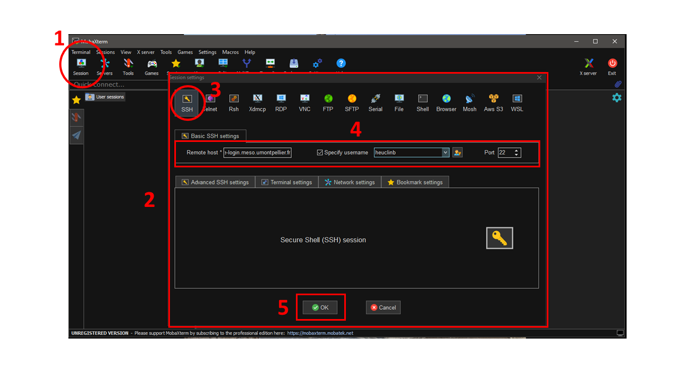
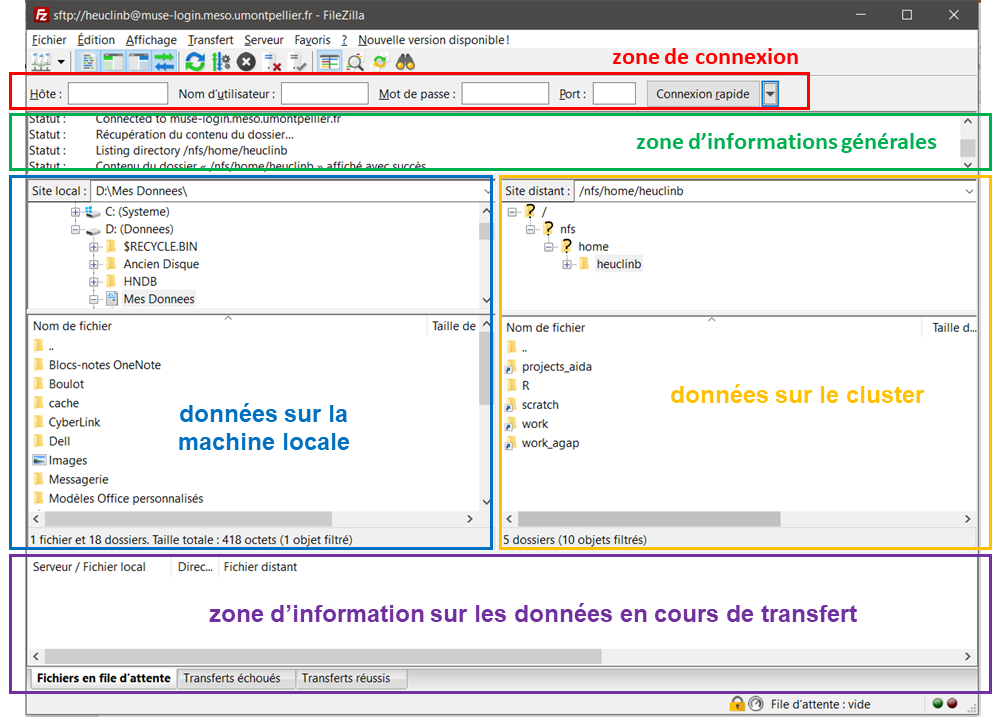
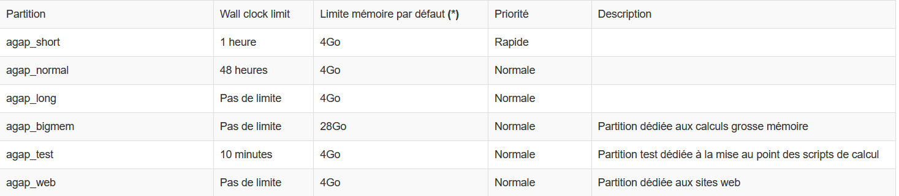

Tuto : Cluster Muse
===================

***Axe transversal TIM, UR AIDA***

*Benjamin Heuclin, Ingénieur statisticien, UR AIDA, Cirad*

*Septembre 2022*

Licence : <a rel="license" href="http://creativecommons.org/licenses/by-nc/4.0/"></a><br />Ce(tte) œuvre est mise à disposition selon les termes de la <a rel="license" href="http://creativecommons.org/licenses/by-nc/4.0/">Licence Creative Commons Attribution - Pas d’Utilisation Commerciale 4.0 International</a>.

___

0. [C'est quoi un cluster de calcul ? et la parallélisation ?](#cluster_parallelisation)
    1. [Cluster de calcul](#cluster)
    2. [La paralélisation](#parallelisation)
1. [Connexion au Cluster](#connexion)
2. [Transfer de fichier](#transfer) 
    1. [FileZilla](#filezilla)
    2. [rsync](#rsync)
3. [Les espaces de stockage](#stockage)
4. [Procedure de soumission de jobs R](#proc_soumission)
    1. [Les partitions](#partitions)
    2. [Soumission de jobs](#soumission)
5. [Les commandes SLURM utiles](#commandes)
6. [Exemples](#exemples)
    1. [Exemple R OpenMP](#ex_R_openMP)
    2. [Exemple R array](#ex_R_array)
7. [Version Rstudio en ligne](#rstudio) 
8. [Ressources](#ressources)

___


> 🚨 Ce document se limite à l'utilisation de R sur CPU, avec une parallélisation en mémoire partagée (openMP). C'est une initation pour prendre rapidement en main le processus de soumission de jobs.

Pour les agents Cirad, il faut demander l'accès à Bertrand Pitollat ([bertrand.pitollat@cirad.fr](mailto:bertrand.pitollat@cirad.fr)) en lui envoyant un email en précisant l'unité, votre numéro de poste téléphonique CIRAD accompagné de la charte signée.  


Vous obtenez  ainsi un nom d'utilisateur (généralement celui de votre compte Cirad) et un mot de passe (généralement le même que celui de votre compte Cirad).

Pour utiliser le cluster, il faut un terminal unix pour ce connect, soumettre et gérer vos jobs et un logiciel de transfert de fichier pour envoyer vos codes, ... de votre PC vers le cluster et vice-versa.


Documentation Muse : https://meso-lr.umontpellier.fr/documentation-utilisateurs/


---


<a name="cluster_parallelisation"></a>

# 0. C'est quoi un cluster de calcul ? et la parallélisation ?


<a name="cluster"></a>

## 0.1 Cluster de calcul


<a name="parallelisation"></a>

## 0.2 La paralélisation

Calcul en mémoire distribué (MPI)

Calcul en mémoire partagée (Multi-thread,
OpenMP)


https://cwant.github.io/hpc-beyond/21-introduction-to-parallelism/index.html


https://stackoverflow.com/questions/32464084/what-are-the-differences-between-mpi-and-openmp


OpenMP is a way to program on shared memory devices. This means that the parallelism occurs where every parallel thread has access to all of your data.

You can think of it as: parallelism can happen during execution of a specific for loop by splitting up the loop among the different threads.

MPI is a way to program on distributed memory devices. This means that the parallelism occurs where every parallel process is working in its own memory space in isolation from the others.

You can think of it as: every bit of code you've written is executed independently by every process. The parallelism occurs because you tell each process exactly which part of the global problem they should be working on based entirely on their process ID.

The way in which you write an OpenMP and MPI program, of course, is also very different.


---


<a name="connexion"></a>

# 1. Connexion au Cluster 


C'est très simple ! La connexion au cluster de calcul haute performance se fait via le protocole SSH. Le nom d’hôte de la machine de connexion est `muse-login.meso.umontpellier.fr`.

Suivant votre système d’exploitation, vous pouvez vous y connecter comme suit :

**Sous linux ou Mac :**

Ouvrir une connexion ssh dans un terminal en tapant la commande suivante : 

```
ssh «nom_utilisateur»@muse-login.meso.umontpellier.fr
```
Entrer ensuite votre MDP.

Sous Mac, vous pouvez également utiliser le logiciel Xquartz.

Vous voilà maintenant connecté au cluster Muse. Le cluster Muse utilise le gestionnaire de job SLURM. C'est d'ici que vous pourez exécuter et gérer vos jobs avec les commandes spécifiques SLURM (voir plus bas pour les principales commandes). 


**Sous windows :**

Installer le logiciel MobXterm (https://mobaxterm.mobatek.net/download-home-edition.html). Lors de la première connexion, il faut la configurer !

Configuration :

1. Cliquer sur le bouton Session (en haut à gauche)
2. Une fenêtre "*Session settings*" s'ouvre alors
3. Cliquer sur SSH (en haut à gauche)
4. Remplir les champs suivant : 
    a. *Remote host* : `muse-login.meso.umontpellier.fr`
    b. Sélectionner *Specify username*
    c. Entrer votre nom d'utilisateur
    d. *Port* : 22
5. Cliquer sur OK





6. Un terminal unix s'ouvre. 
7. Il faut ensuite entrer votre mot de passe (rien ne s'affiche lorsque vous tapez le mdp, c'est un réglage de sécurité) puis valider en appuyant sur "entrée".
8. MobaXterm vous demande si vous voulez enregistrer le mdp pour ne plus vous le demander. C'est vous qui voyez !


> 🤩 Pour les prochaines fois, vous n'aurez qu'à ouvrir MobaXterm et à cliquer sur votre session que vous trouverez dans l'onglet "*User sessions*" sur la gauche.  
Vous pouvez également créer un raccourci sur votre bureau en faisant un clique droit dessus. Cela permet d'ouvrir votre session en même temps que le logiciel se lance. C'est trop bien 🤩


Vous voilà maintenant connecté au cluster Muse. Le cluster Muse utilise le gestionnaire de job SLURM.  C'est d'ici que vous pourrez exécuter et gérer vos jobs avec les commandes spécifiques SLURM (voir section [4.2 Soumission de jobs](#soumission)). 


**Quelsques commandes Linux utiles :**

* `ls` pour afficher le contenu du répertoir courant
* `ls -a` pour afficher tous les fichiers (même caché) du répertoir courant
* `cd "path"` pour changer de répertoir
* `cd ..` pour aller au répertoir parent
* `pwd` pour afficher le chemin absolut du répertoir courant (depuis la racine)
* ⬆️⬇️ **Flèche haut/bas** pour naviger dans historique des commandes utilisées

Pour plus d'info sur les commandes Linux de bases :
https://doc.ubuntu-fr.org/tutoriel/console_commandes_de_base


<a name="transfer"></a>

# 2. Transfer de fichiers

Pour soumettre vos jobs, il va falloir envoyer vos scripts sur le cluster. Il vous faudra ensuite récupérer les fichiers générés par vos jobs. Pour ce faire, on va utiliser le logiciel FileZilla. Il est disponible sous Windows, OSX et Linux. Pour le téléchargement de fichiers volumineux du cluster vers votre machine (long avec FileZilla) il est possible d'utiliser "rsunc"


<a name="filezilla"></a>

# 2.1. FileZilla


Installer FileZilla : https://filezilla-project.org/download.php?show_all=1

> **Remarque pour Linux** : Filezilla est disponible par l’intermédiaire de votre Gestionnaire de paquets `apt-get install filezilla`

**Présentation de FileZilla : **



Pour ce connecter, remplir dans la zone de connection :

* **Hôte** : `sftp://muse-login.meso.umontpellier.fr`
* **Nom d'utilisateur** : votre nom d'utilisateur 
* **Mot de passe** : votre mot de passe
* **Port** : 22


> 🤩 Après la première connexion, ces informations seront enregistrées et vous pourrez vous connecter facilement en cliquant sur la petite flèche à côté de "Connexion rapide"

Vous pouvez transférer un fichier dans un sens ou dans l'autre en cliquant droit dessus puis cliquer sur "Téléversé" ou "Télécharger".


<a name="rsunc"></a>

# 2.2. rsync

source : https://meso-lr.umontpellier.fr/documentation-utilisateurs/

```
#! /usr/bin/env bash
###################################################################
# rsync.sh : Ecrit par Jérémy Verrier				  #
# Script permettant la copie sécurisée de fichiers ou de dossiers #
###################################################################

# Entrez votre nom d'utilisateur
USER=
# Entrez le chemin complet du répertoire ou du fichier à copier (/home/verrier/work/results.txt)
DOSSIER_CLUSTER=
# Entrez le chemin complet du répertoire ou du fichier de destination
DOSSIER_PERSO=

while [ 1 ]
do
    rsync -avz --progress --partial "${USER}"@muse-login.meso.umontpellier.fr:"${DOSSIER_CLUSTER}" "${DOSSIER_PERSO}"
    if [ "$?" = "0" ] ; then
        echo "Rsync OK"
        exit
    else
        echo "Rsync erreur, nouvelle tentative dans 1 minute..."
        sleep 60
    fi
done
```


A enregister au au format .sh ou à télécharger avec le lien ci-dessous.

[Ce script](https://hpc-lr.umontpellier.fr/wp-content/uploads/2017/05/rsync.txt) vous permet de copier des données depuis le cluster Muse vers votre machine.
Il vous faut modifier les champs USER, DOSSIER_CLUSTER et DOSSIER_PERSO et ensuite le lancer avec la commande « bash rsync ».
Il est vivement conseillé d’utiliser ce script lors de téléchargement de fichiers volumineux.


<a name="stockage"></a>

# 3. Les espaces de stockage

Il y a plusieurs espaces de stockage. Les fichiers déposés sur le répertoire "scratch" sont temporaires pour effectuer vos calculs, et sont automatiquement supprimés à 60 jours. Les documents destinés à être conservés doivent être déposés sur votre répertoire "home".

Email de Bertrand Pitollat du 19/10/2021 :

___
Vous disposez de plusieurs espaces de stockage sur le cluster Muse :

- **home directory** : C'est votre point d'entrée sur le cluster Muse.
  * Il est hébergé sur la baie NFS du cluster Muse.
  * Il n'est ni sauvegardé ni répliqué.
  * Il est limité à un quota de 50 Go (hors autres espaces de stockage).
  * Il est accessible en lecture et en écriture depuis les noeuds de login et en lecture seule depuis les noeuds de calcul.

- **répertoire personnel sur la baie répliquée : lien replicated**
  * Il est hébergé sur la baie NetApp du cluster Muse.
  * Ce répertoire est personnel.
  * Il est destiné au stockage long terme des données personnelles.
  * Il est accessible via le lien replicated de votre home directory (par exemple, /home/pitollatb/replicated => /storage/replicated/cirad_users/pitollatb).
  * Il est sauvegardé et répliqué sur une baie de secours.
  * Il est limité à un quota de 500Go.
  * Il est accessible en lecture et en écriture depuis les noeuds de login et de calcul.

- **espace projets / unités / équipes sur la baie répliquée : lien projects**
  * Cet espace est hébergé sur la baie NetApp du cluster Muse.
  * Il est destiné au stockage long terme des données projets / unités / équipes.
  * L'espace est accessible via le lien projects de votre home directory (par exemple, /home/pitollatb/projects => /storage/replicated/cirad/projects).
  * Il est sauvegardé et répliqué sur une baie de secours.
  * Il est partitionné par répertoire projet, unité ou équipe avec un quota initial de 5To pour chaque répertoire.
  * Chaque répertoire projet peut être associé à un groupe d'utilisateurs à définir par le collectif.
  * L'espace est accessible en lecture et en écriture depuis les noeuds de login et de calcul.

- **espace work : lien work_agap**
  * Il est hébergé sur la baie NFS du cluster Muse.
  * Cet espace de stockage précédemment dédié au stockage des données projets ne doit plus être utilisé.
  * Les données s'y trouvant doivent être transférées dans le nouvel espace projets / unités / équipes.
  * Il n'est ni sauvegardé ni répliqué.
  * Il est accessible via le lien work_agap de votre home directory (par exemple, /home/pitollatb/work_agap => /nfs/work/agap).
  * Il est accessible en lecture et en écriture depuis les noeuds de login et en lecture seule depuis les noeuds de calcul.

- **espace personnel scratch : lien scratch**
  * Il est hébergé sur la baie Lustre du cluster Muse.
Ce espace est personnel.
  * Il est rapide et performant et doit être utilisé pour héberger les données temporaires de calcul.
  * A la fin du calcul, les données doivent être supprimées ou déplacées.
  * Il est accessible via le lien scratch de votre home directory (par exemple, /home/pitollatb/scratch => /lustre/pitollatb).
  * Il n'est ni sauvegardé ni répliqué.
  * Il est limité dans le temps : les données vieilles de plus de 2 mois seront bientôt automatiquement supprimées.
  * Il est accessible en lecture et en écriture depuis les noeuds de login et de calcul.

- **banques de données scratch : /lustre/agap**
  * Cet espace communautaire stocke les banques de données.
  * Il est hébergé sur la baie Lustre du cluster Muse pour optimiser les calculs.
  * Il n'est ni sauvegardé ni répliqué.
  * Il ne doit pas être utilisé pour stocker de données personnelles.
  * Il est accessible à l'emplacement /lustre/agap.
  * Les banques maintenues par biomaj sont accessibles à l'emplacement /lustre/agap/BANK/biomaj.

- **espace web :** Par ailleurs, il existe un espace dédié pour héberger les données affichées/diffusées par nos différents services web (genome hubs, ...).
Nous contacter si nécessaire.

**Important :**
Je vous rappelle que pour des raisons de performance du cluster Muse, toutes les écritures issues des jobs doivent être redirigées vers votre répertoire scratch et qu'il faut bannir toute lecture intensive depuis les espaces NFS et NetApp.

___


<a name="proc_soumission"></a>

# 4. Procedure de soumission de jobs R

Dans cette section j'explique comment soumettre des jobs en parallèle sous R. Avant de rentrer dans le vif du sujet, il faut choisir une partition sur laquelle lancer les jobs.


<a name="partitions"></a>

## 4.1. Les partitions

Il faut choisir le type de partition sur laquelle lancer vos jobs. Il existe plusieurs partions avec des paramètres différents sur lesquelles vous pouvez soumettre vos jobs :



Sur chaque partition, il y a un certain nombre de noeuds (nodes) (je n'ai pas compté combien). Chaque noeud contient 28 coeurs (cores).
Pour les novices, un noeud peut être apparenté à un ordinateur et les coeurs aux processeurs.

En tant qu'utilisateur Cirad, nous avons accès aux partitions :

* *agap_short* pour des jobs rapides (limite de 1h)
* *agap_normal* pour des jobs de 2 jours max
* *agap_long* pour des jobs chronophages (pas de limite de temps)
* *agap_bigmem* pour des jobs nécessitant beaucoup de mémoire vive (pas de limite de temps)

La mémoire vive par coeur est limitée par défaut (voir 3ème colonne) mais elle peut être augmentée en ajoutant le paramètre `--mem-per-cpu=XG`, avec X la quantité de mémoire allouée au job (en théorie, max de 128G pour la queue *agap_short*, *agap_normal*, et *agap_long*, et max de 3000G pour la queue *agap_bigmem*).


<a name="soumission"></a>

## 4.2. Soumission de jobs


Pour illustrer la soumission d'un job en parallèle, nous utiliserons l'Exemple_R. Dans cet exemple bidon, je répète l'opération 2*k pour k=1 à 50. Je veux paralléliser ces opérations sur 10 coeurs pour aller 10 fois plus vite. Je sauvegarde chaque résultat dans un ".Rdata" dans un fichier "results".


Pour soumettre un job, vous devez choisir entre :

  * Un mode d’exécution en temps réel avec la commande srun directement dans le terminal (non détaillé dans ce tuto)
  * Un mode d’exécution différé en définissant son job dans un script ***batch*** et en le lancer à l’aide de la commande `sbatch` dans le terminal


⚠️ **J'explique ici uniquement la procédure différée avec la commande `sbatch`** 

Cette procédure consiste à définir les paramètres d'exécution dans un fichier *batch* (.sh)

Ce fichier peut être éditer avec [**Notepad++**](https://notepad-plus-plus.org/downloads/) ou **Rstudio**.
Pour le créer : 

* avec **Notepad++** : *File > New* puis sauvegarder avec l'extension *.sh*
* avec **Rstudio** : *File > New File > Shell Script*

👉 Mais le plus simple est de reprendre un fichier .sh qu'on a sous la main 


💥🔥 **Alerte Windows** 🚨🧯 **Attention aux retours à la ligne !!!**  
Par défault dans Windows les retours chariot sont de type DOS et ils ne sont pas compatible avec Linux ou Max de type UNIX (Posix LF) et ça plantle !  
Il faut soit :

* utiliser **Notepad++** en faisant :  
*Edition > Convertir les sauts de ligne > Convertir en format UNIX (LF)*  
⚠️ a faire pour chaque nouveau fichier
* utiliser **Rstudio** en réglant l'option des retours à la ligne de type Unix :  
*Tools > Global options > Code > Saving > Serialization > Line ending conversion > Posix (LF)*  
A faire qu'une seule fois ❤️💪 Il sait tout faire ce Rstudio ! 💪❤️ 


**Prenons le fichier *batch* de l'Exemple_R** pour voir sa construction

```
#!/bin/bash
#SBATCH --partition=agap_short
#SBATCH --job-name ex1
#SBATCH --nodes=1
#SBATCH --ntasks=10
#SBATCH --mem-per-cpu=1G
#SBATCH --time=01:00:00
#SBATCH --mail-type=begin        # send email when job begins
#SBATCH --mail-type=end          # send email when job ends
#SBATCH --mail-user=benjamin.heuclin@cirad.fr

module purge              # décharge tous les modules       
module load cv-standard   # majorité des compilateurs/bibliothèques standards
module load R/3.6.1       # chargement de R version 3.6.1

R CMD BATCH /storage/replicated/cirad/projects/AIDA/Atelier_cluster/Exemple_1/main_script.R    /storage/replicated/cirad/projects/AIDA/Atelier_cluster/Exemple_1/Rout/main_script.Rout

```

Ce fichier se décompose en 3 parties :

* 1re partie : chaque ligne commençant par `#SBATCH` décrit un paramètre **SLURM** :
    * `--partition=` pour sélectionner la partition
    * `--job-name ` pour donner un nom à la soumission
    * `--nodes=` nombre de noeuds (toujours 1 dans ce tuto)
    * `--ntasks=` nombre de tâches pour la parallélisation, correspond au nb de coeurs puisque 1 noeud 
    * `--mem-per-cpu=` quantité de mémoire vive par coeur
    * `--time=` temps maximum
    
D'autres options existent, se référer à la documentation du cluster pour plus d'info (https://meso-lr.umontpellier.fr/documentation-utilisateurs/).

* 2ème partie : Il faut ensuite charger les **modules** (logiciels, compilateurs) avec la commande `module load`. 
[Les modules reposent sur un système de dépendances et de conflits fixés par la personne ayant installé ou compilé le logiciel ou la librairie visée.]: # 
On commance par décharcher tous les modules qui peuvent être chargés.
Pour utiliser le logiciel R, en fonction de la version, il faut charger le module `cv-standard` et ensuite `R/version` ou `R` (charge la dernière version 4.2.2). Si votre code utilise un autre langage (c++, python, ...), il faudra alors charger les modules en conséquence. Pour voir la liste des modules disponibles : `module avail`. Plus d'info sur les modules dans la documentation du cluster (https://meso-lr.umontpellier.fr/documentation-utilisateurs/) section "Environnement logiciel du Cluster Muse" et le TP : https://meso-lr.umontpellier.fr/wp-content/uploads/2020/03/1-TP-Environment_module3.pdf. Je vous conseille de précicer la version de R avec laquelle vous voulez travailler pour ne pas avoir de surprise si une nouvelle version est installée. Les versions de R disponibles sont :
    * en local (installé par muse@lr) :
        * `R/3.6.1`
        * `R/3.6.1-tcltk `
        * `R/3.6.3 `
        * `R/4.0.2`
        * `R/4.2.2`
    * dans cv-standard (la majorité des compilateurs et bibliothèques standards) :
        * `R/3.3.1`
        * `R/3.4.3`
    
**Vous pouvez aussi installer vos propres logiciels.**


* 3ème partie : Enfin la ligne pour exécuter le script R : `R CMD BATCH ` suivie du chemin d'accès vers le script, suivi du chemin d'accès vers le **Rout** pour écrire les sorties (ce qui s'affiche dans la console de Rstudio en temps normal). **Pensez à créer le fichier Rout dans votre projet**.


Pour lancer votre code, il faut exécuter dans le terminal le fichier batch associé avec la commande :
```
sbatch job_submission.sh
```


**Attention** : si votre code nécessite le chargement de packages ("doParallel" pour l'Exemple_1), il faut impérativement les installer avant. Pour ce faire, dans le terminal, charger les modules puis lancer R :
```
module load cv-standard R/3.6.1
R
```
Installer ensuite les packages (il vous faudra choisir un miroir) :
```
install.packages("doParallel")
```
Enfin quitter R avec la commande `q()`.


**Si tu as un fichier coronpu à cause des retour à la ligne**
```
-bash-4.2$ sbatch job_submission.sh
sbatch: error: Batch script contains DOS line breaks (\r\n)
sbatch: error: instead of expected UNIX line breaks (\n).
```
tu peux soit :

* dans **Notepad++** faire :  *Edition > Convertir les sauts de ligne > Convertir en format UNIX (LF)*
* dans **Rstudio** (avec l'option qui va bien comme décrit juste au dessus) : modifier légèrement ton .sh (avec un saut de ligne par exemple) et le sauvegarder. Rstudio va automatiquement convertir les sauts de ligne


<a name="commandes"></a>

# 5. Les commandes SLURM utiles


Pour voir l'état de tous les jobs (de tous les utilisateurs)
```
squeue
```


Pour voir l'état de vos jobs 
```
squeue -u $USER -o '%.18i %.9P %.20j %u %.8T %.10M %.9l %.6D %R'
```


Pour tuer un job
```
scancel <JOB_ID>
```


Pour voir le nombre de coeurs disponibles par noeud (très utile pour choisir le nombre de coeurs pour passer devant toute la fille d'attente)
```
sinfo -o "%P %n %C"
```

* La 1er colonne (%P) donne la partition
* La 2ème colonne (%n) donne l'identifiant du noeud
* La 3ème colonne (%C) donne le nombre de CPUs par état dans le format "alloué/libre/autre/total"


Consulter la quantité de mémoire consommée par le job après son exécution : 
```
sacct -o JobID,Node,AveRSS,MaxRSS,MaxRSSTask,MaxRSSNode,TRESUsageInTot%250 -j <JOB_ID> 
```


Plus d'info sur les commandes ici : https://slurm.schedmd.com/man_index.html


<a name="exemples"></a>

# 6. Exemples


<a name="ex_R_openMP"></a>

## 6.1. Exemple R OpenMP


<a name="ex_R_array"></a>

## 6.2. Exemple R array

Dans cet exemple, je souhaite lancer un code (une fonction) mais avec plusieurs paramètres différents en entrée (On peut aussi imaginer lancer un code sur plusieurs jeux de données différentes ou mixer les deux).

Pour cela j'ai une fonction `my_fct` qui prend 3 paramètre d'entrée `n`, `p` et `k` et qui renvoie le produit `n*p*k` (très simple !) et je veux l'appliquer pour différentes valeurs d'entrée :

* `n` = 1 ou 2
* `p` = 1, 2 ou 3
* `k` = 1 ou 2

Celà fait `2*3*2 = 12` combinaisons et donc 12 exécutions de mon code. Les exécutions sont indépendantes et donc on peut optimiser le lancement de ce job à l'aide d'un **array**. Le principe est qu'on demande au cluster un certain nombre de CPUs et le cluster va les choisir potentiellement dans des noeuds (node) differents.   
On est donc sur une forme de paralélisation MPI ! 

> Lorsqu'il y a beaucoup de jobs en attente sur le cluster, cela permet à votre job de passe plus vite car c'est plus facile de prendre *n* CPUs par-ci par-là plutôt que *n* CPUs sur le même noeud 

Pour ce faire, on spécifie l'option `--array` dans le batch (.sh) :


```
#!/bin/bash
#SBATCH --partition=agap_short  # la partition
#SBATCH --job-name array        # nom du job
#SBATCH --array=1-12            # OPTION ARRAY 
#SBATCH -o array-%a.out
#SBATCH --mem-per-cpu=100M      # Mémoire par CPU
#SBATCH --time=00:30:00         # Temps limite

module purge
module load cv-standard
module load R/3.6.1

cd $SLURM_SUBMIT_DIR

Rscript ./main_script.R $SLURM_ARRAY_TASK_ID
```

⚠️ **Attention** : On ne précise pas le nombre de noeud (-N) et de coeur (-n) que l'on souhaite. C'est SLURM qui va répartir en fonction des ressources disponibles.

Sur la dernière ligne d'exécution du script R, on rajoute la variable d'environnement `$SLURM_ARRAY_TASK_ID`, cela permet au script R de récupérer le numéro de la tâche.  
Et enfin dans le script R il faut utiliser la commande `as.numeric(commandArgs(trailingOnly=TRUE)[1])` pour récupérer l'indice (*i*). Je peux ainsi lancer la fonction sur la ligne *i* ème ligne de ma grille de paramètres.

```
# on récupère l'indice de la tâche ($SLURM_ARRAY_TASK_ID)
i = as.numeric(commandArgs(trailingOnly=TRUE)[1])

# Définition d'une grille de paramètres que je veux faire varier
pars <-  expand.grid(n = 1:2, p = 1:3, k = 1:2)

# Définition de ma fonction
my_fct <- function(n, p, k) return(n*p*k)

# Execution de la fonction sur la ligne i de la grille de paramètres
result <- my_fct(n=pars$n[i], p=pars$p[i], k=pars$k[i])
print(paste0("Le resultat de ma fonction est : ", result))
```


<a name="rstudio"></a>

# 7. Version Rstudio en ligne 

http://193.52.26.138/rstudio/auth-sign-in

* **Partition** : ???
* **Nb nodes** : ???
* **Nb cores** : ???
* **Limite de temps** : ???
* **Mémoire** : ???


<a name="ressources"></a>

# 8. Ressources

**Mailing list d'entraides :**
meso-help@umontpellier.fr


**Site web sur cluster Muse HPC@LR :**
https://meso-lr.umontpellier.fr/documentation-utilisateurs/


**Présentation du cluster Muse HPC@LR :**
https://meso-lr.umontpellier.fr/wp-content/uploads/2019/11/1-Presentation_cluster_Muse.pdf

**TP-Environment Module :**
https://meso-lr.umontpellier.fr/wp-content/uploads/2020/03/1-TP-Environment_module3.pdf

**TP-SLURM :**
https://meso-lr.umontpellier.fr/wp-content/uploads/2020/04/1-TP-SLURM3.pdf

**Commandes Linux de bases :**
https://doc.ubuntu-fr.org/tutoriel/console_commandes_de_base

